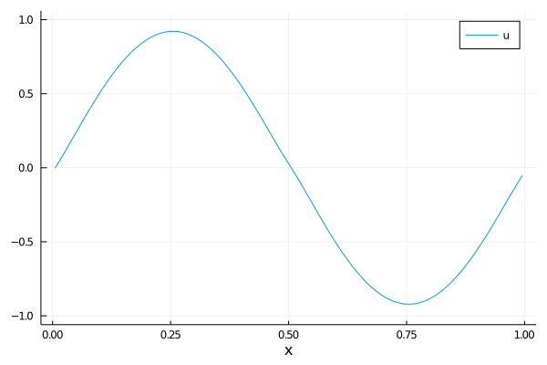

# Advection diffusion

The first example is the scalar advection-diffusion equation.
It's a one dimensional problem in physical domain ``x``.
Let's first configure the solver setup.
```julia
using ProgressMeter, OffsetArrays, Plots
import KitBase

set = KitBase.Setup(
    "scalar", # matter
    "advection", # case
    "1d0f0v", # space
    "gks", # flux
    "", # collision: for scalar conservation laws there are none
    1, # species
    2, # interpolation order
    "vanleer", # limiter
    "period", # boundary
    0.5, # cfl
    1.0, # simulation time
)

pSpace = KitBase.PSpace1D(0.0, 1.0, 100, 1)
vSpace = nothing
property = KitBase.Scalar(1.0, 1e-6)

w0 = 1.0
prim0 = KitBase.conserve_prim(w0, property.a)
ib = KitBase.IB(w0, prim0, prim0, w0, prim0, prim0)
folder = @__DIR__
ks = KitBase.SolverSet(set, pSpace, vSpace, property, ib, folder)
```

The we allocate the data structure needed.
```julia
ctr = OffsetArray{KitBase.ControlVolume1D}(undef, eachindex(ks.pSpace.x))
for i in eachindex(ctr)
    u = sin(2π * ks.pSpace.x[i])
    ctr[i] = KitBase.ControlVolume1D(
        ks.pSpace.x[i],
        ks.pSpace.dx[i],
        u,
        KitBase.conserve_prim(u, ks.gas.a)
    )
end

face = Array{KitBase.Interface1D}(undef, ks.pSpace.nx+1)
for i = 1:ks.pSpace.nx+1
    face[i] = KitBase.Interface1D(0.0)
end
```

The solution algorithm can be processed together with visualization.
```julia
t = 0.0
dt = KitBase.timestep(ks, ctr, t)
nt = ks.set.maxTime / dt |> Int

anim = @animate for iter = 1:nt
    KitBase.reconstruct!(ks, ctr)
    
    for i in eachindex(face)
        face[i].fw = KitBase.flux_gks(
            ctr[i-1].w,
            ctr[i].w,
            ks.gas.μᵣ,
            dt,
            0.5 * ctr[i-1].dx,
            0.5 * ctr[i].dx,
            ks.gas.a,
            0.,
            0.,
        )
    end

    for i in 1:ks.pSpace.nx
        ctr[i].w += (face[i].fw - face[i+1].fw) / ctr[i].dx
        ctr[i].prim .= KitBase.conserve_prim(ctr[i].w, ks.gas.a)
    end
    ctr[0].w = ctr[ks.pSpace.nx].w
    ctr[ks.pSpace.nx+1].w = ctr[1].w

    sol = zeros(ks.pSpace.nx)
    for i in 1:ks.pSpace.nx
        sol[i] = ctr[i].w
    end
    plot(ks.pSpace.x[1:ks.pSpace.nx], sol, xlabel="x", label="u", ylims=[-1, 1])
end

gif(anim, "advection.gif", fps = 45)
```

