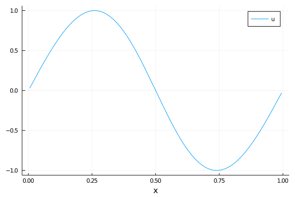

# Burgers

Now we could turn to the Burgers equation.
It's a typical hyperbolic conservation law, where discontinuous solution can emerge in a self-evolving system.
Let's consider the same initial configuration as advection-diffusion example.
```julia
using Kinetic, Plots

set = Setup(
    matter = "scalar", # material
    case = "burgers", # test case
    space = "1d0f0v", # phase space
    flux = "gks", # flux
    collision = "", # collision: for scalar conservation laws there are none
    interpOrder = 1, # interpolation order
    boundary = "period", # boundary condition
    cfl = 0.5, # cfl
    maxTime = 1.0, # simulation time
)
ps = PSpace1D(0.0, 1.0, 100, 1)
vs = nothing
ib = IB(x -> sin(2π * x), property)

ks = SolverSet(set, ps, vs, property, ib)
ctr, face = init_fvm(ks)
```

The solution algorithm can be processed together with visualization.
```julia
t = 0.0
dt = KitBase.timestep(ks, ctr, t)
nt = ks.set.maxTime ÷ dt |> Int

anim = @animate for iter = 1:nt
    reconstruct!(ks, ctr)
    evolve!(ks, ctr, face, dt)
    update!(ks, ctr, face, dt, 0.0)

    plot(ks, ctr, xlabel="x", label="u", ylims=[-1, 1])
end

gif(anim, "burgers.gif", fps = 45)
```


