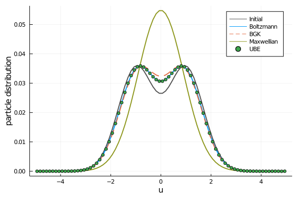

# Universal Boltzmann equation

In the following, we present a universal differential equation strategy to construct the neural network enhanced Boltzmann equation.
The complicated fivefold integral operator is replaced by a combination of relaxation and neural models.
It promises a completely differential structure and thus the neural ODE type training and computing becomes possible.
The approach reduces the computational cost up to three orders of magnitude and preserves the perfect accuracy.
The detailed theory and implementation can be found in [Tianbai Xiao and Martin Frank, Using neural networks to accelerate the solution of the Boltzmann equation](https://arxiv.org/pdf/2010.13649.pdf).

First we load all the packages needed and set up the configurations.
```julia
using OrdinaryDiffEq, Flux, DiffEqFlux, Plots
using KitBase, KitML

begin
    case = "homogeneous"
    maxTime = 3
    tlen = 16
    u0 = -5
    u1 = 5
    nu = 80
    nug = 0
    v0 = -5
    v1 = 5
    nv = 28
    nvg = 0
    w0 = -5
    w1 = 5
    nw = 28
    nwg = 0
    vMeshType = "rectangle"
    nm = 5
    knudsen = 1
    inK = 0
    alpha = 1.0
    omega = 0.5
    nh = 8
end
```

The dataset is produced by the fast spectral method, which solves the nonlinear Boltzmann integral with fast Fourier transformation.
```julia
begin
    tspan = (0.0, maxTime)
    tran = linspace(tspan[1], tspan[2], tlen)
    γ = heat_capacity_ratio(inK, 3)
    vSpace = VSpace3D(u0, u1, nu, v0, v1, nv, w0, w1, nw, vMeshType)

    f0 =
        Float32.(
            0.5 * (1 / π)^1.5 .*
            (exp.(-(vSpace.u .- 0.99) .^ 2) .+ exp.(-(vSpace.u .+ 0.99) .^ 2)) .*
            exp.(-vSpace.v .^ 2) .* exp.(-vSpace.w .^ 2),
        ) |> Array
    prim0 =
        conserve_prim(moments_conserve(f0, vSpace.u, vSpace.v, vSpace.w, vSpace.weights), γ)
    M0 = Float32.(maxwellian(vSpace.u, vSpace.v, vSpace.w, prim0)) |> Array

    mu_ref = ref_vhs_vis(knudsen, alpha, omega)
    kn_bzm = hs_boltz_kn(mu_ref, 1.0)
    τ0 = mu_ref * 2.0 * prim0[end]^(0.5) / prim0[1]

    phi, psi, phipsi = kernel_mode(
        nm,
        vSpace.u1,
        vSpace.v1,
        vSpace.w1,
        vSpace.du[1, 1, 1],
        vSpace.dv[1, 1, 1],
        vSpace.dw[1, 1, 1],
        vSpace.nu,
        vSpace.nv,
        vSpace.nw,
        alpha,
    )

    # Boltzmann
    prob = ODEProblem(boltzmann_ode!, f0, tspan, [kn_bzm, nm, phi, psi, phipsi])
    data_boltz = solve(prob, Tsit5(), saveat = tran) |> Array

    # BGK
    prob1 = ODEProblem(bgk_ode!, f0, tspan, [M0, τ0])
    data_bgk = solve(prob1, Tsit5(), saveat = tran) |> Array


    data_boltz_1D = zeros(Float32, axes(data_boltz, 1), axes(data_boltz, 4))
    data_bgk_1D = zeros(Float32, axes(data_bgk, 1), axes(data_bgk, 4))
    for j in axes(data_boltz_1D, 2)
        data_boltz_1D[:, j] .=
            reduce_distribution(data_boltz[:, :, :, j], vSpace.weights[1, :, :])
        data_bgk_1D[:, j] .=
            reduce_distribution(data_bgk[:, :, :, j], vSpace.weights[1, :, :])
    end
    f0_1D = reduce_distribution(f0, vSpace.weights[1, :, :])
    M0_1D = reduce_distribution(M0, vSpace.weights[1, :, :])

    X = Array{Float32}(undef, vSpace.nu, 1)
    for i in axes(X, 2)
        X[:, i] .= f0_1D
    end
    Y = Array{Float32}(undef, vSpace.nu, 1, tlen)
    for i in axes(Y, 2)
        Y[:, i, :] .= data_boltz_1D
    end
    M = Array{Float32}(undef, nu, size(X, 2))
    for i in axes(M, 2)
        M[:, i] .= M0_1D
    end
    τ = Array{Float32}(undef, 1, size(X, 2))
    for i in axes(τ, 2)
        τ[1, i] = τ0
    end
end
```

Then we define the neural network and construct the unified model with mechanical and neural parts.
The training is conducted by DiffEqFlux.jl with ADAM optimizer.
```julia
begin
    model_univ = DiffEqFlux.FastChain(
        DiffEqFlux.FastDense(nu, nu * nh, tanh),
        DiffEqFlux.FastDense(nu * nh, nu),
    )
    p_model = DiffEqFlux.initial_params(model_univ)

    function dfdt(f, p, t)
        df = (M .- f) ./ τ .+ model_univ(M .- f, p)
    end
    prob_ube = ODEProblem(dfdt, X, tspan, p_model)

    function loss(p)
        sol_ube = solve(prob_ube, Midpoint(), u0 = X, p = p, saveat = tran)
        loss = sum(abs2, Array(sol_ube) .- Y)

        return loss
    end

    his = []
    cb = function (p, l)
        display(l)
        push!(his, l)
        return false
    end
end

res = DiffEqFlux.sciml_train(loss, p_model, ADAM(), cb = cb, maxiters = 200)
res = DiffEqFlux.sciml_train(loss, res.minimizer, ADAM(), cb = cb, maxiters = 200)
```

Once we have trained a hybrid Boltzmann collision term, we could solve it as a normal differential equation with any desirable solvers.
Consider the Midpoint rule as an example, the solution algorithm and visualization can be organized.
```julia
ube = ODEProblem(KitML.ube_dfdt, f0_1D, tspan, [M0_1D, τ0, (model_univ, res.minimizer)]);
sol = solve(
    ube,
    Midpoint(),
    u0 = f0_1D,
    p = [M0_1D, τ0, (model_univ, res.minimizer)],
    saveat = tran,
);

plot(
    vSpace.u[:, vSpace.nv÷2, vSpace.nw÷2],
    data_boltz_1D[:, 1],
    lw = 2,
    label = "Initial",
    color = :gray32,
    xlabel = "u",
    ylabel = "particle distribution",
)
plot!(
    vSpace.u[:, vSpace.nv÷2, vSpace.nw÷2],
    data_boltz_1D[:, 2],
    lw = 2,
    label = "Boltzmann",
    color = 1,
)
plot!(
    vSpace.u[:, vSpace.nv÷2, vSpace.nw÷2],
    data_bgk_1D[:, 2],
    lw = 2,
    line = :dash,
    label = "BGK",
    color = 2,
)
plot!(
    vSpace.u[:, vSpace.nv÷2, vSpace.nw÷2],
    M0_1D,
    lw = 2,
    label = "Maxwellian",
    color = 10,
)
scatter!(vSpace.u[:, vSpace.nv÷2, vSpace.nw÷2], sol.u[2], lw = 2, label = "UBE", color = 3)
```

